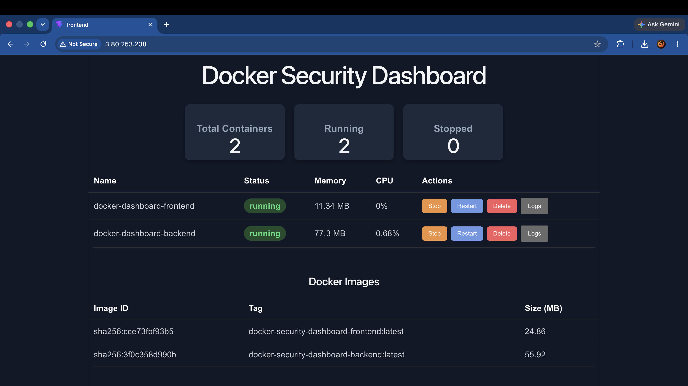
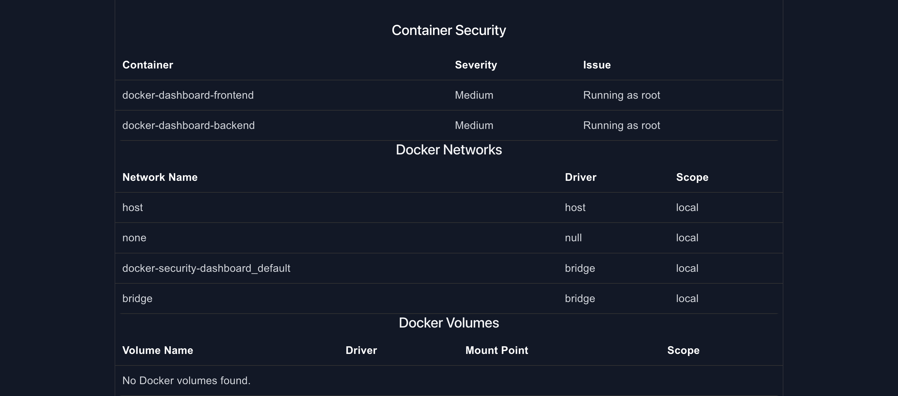

# Docker Security Dashboard

A full-stack Docker monitoring and security dashboard built with **React**, **FastAPI**, **Docker SDK**, **Nginx**, and **Docker Compose**. The dashboard provides real-time visibility into Docker containers, images, networks, volumes, security issues, and container logs through a modern web interface.

---

## Features

- Real-time Docker container monitoring
- Start, stop, restart, and delete containers
- View Docker images and image sizes
- Monitor Docker networks
- Inspect Docker volumes
- Display container security findings
- View live container logs
- Automatic dashboard refresh
- Responsive React frontend
- FastAPI REST API backend
- Dockerized frontend and backend
- Nginx production deployment
- One-command deployment using Docker Compose

---

## Tech Stack

### Frontend

- React
- JavaScript
- Fetch API
- CSS

### Backend

- FastAPI
- Python
- Docker SDK for Python

### DevOps

- Docker
- Docker Compose
- Nginx
- AWS EC2

---

## Project Structure

```
docker-security-dashboard/
│
├── backend/
│   ├── main.py
│   ├── docker_service.py
│   ├── requirements.txt
│   └── Dockerfile
│
├── frontend/
│   ├── src/
│   ├── nginx.conf
│   ├── Dockerfile
│   └── package.json
│
├── docker-compose.yml
└── README.md
```

---

## Dashboard Features

### Container Management

- List running and stopped containers
- Start containers
- Stop containers
- Restart containers
- Delete containers
- View live container logs

### Images

- List Docker images
- Image tags
- Image IDs
- Image sizes

### Security

- Detect containers running as root
- Display security findings with severity levels

### Networks

- View Docker networks
- Network driver
- Network scope

### Volumes

- List Docker volumes
- Driver information
- Mount paths
- Scope

### Summary Cards

- Total Containers
- Running Containers
- Stopped Containers

---

## Running Locally

Clone the repository

```bash
git clone https://github.com/YOUR_USERNAME/docker-security-dashboard.git
cd docker-security-dashboard
```

Start the application

```bash
docker compose up --build
```

Open

```
http://localhost
```

---

## API Endpoints

| Method | Endpoint | Description |
|----------|---------------------------|-----------------------------|
| GET | `/summary` | Dashboard summary |
| GET | `/containers` | List containers |
| POST | `/containers/{id}/start` | Start container |
| POST | `/containers/{id}/stop` | Stop container |
| POST | `/containers/{id}/restart` | Restart container |
| POST | `/containers/{id}/delete` | Delete container |
| GET | `/containers/{id}/logs` | Container logs |
| GET | `/images` | Docker images |
| GET | `/security` | Security findings |
| GET | `/networks` | Docker networks |
| GET | `/volumes` | Docker volumes |

---

## Docker Architecture

```
                Browser
                   │
                   ▼
             Nginx (Frontend)
                   │
          /api requests
                   │
                   ▼
          FastAPI Backend
                   │
            Docker SDK
                   │
                   ▼
           Docker Engine
```

---

## Deployment

The application is fully containerized and can be deployed using Docker Compose.

Example deployment target:

- AWS EC2
- Ubuntu Server
- Docker
- Docker Compose
- Nginx

Run

```bash
docker compose up -d --build
```

---

## Screenshots

### Dashboard




---

## Future Improvements

- Authentication and user login
- Real-time updates using WebSockets
- Container metrics (CPU, Memory, Network)
- Image vulnerability scanning
- Prometheus integration
- Grafana dashboards
- Role-Based Access Control (RBAC)
- Dark/Light themes
- Kubernetes support